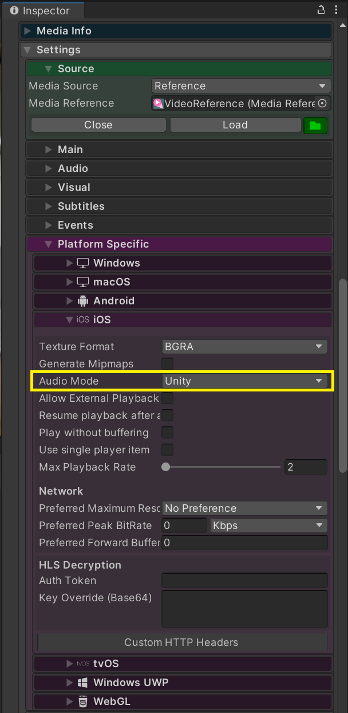

# ImmersiveVideoPlayer using AVProVideo

### Define symbol for AVProVideo extension
<image src="./DefineSymbol01.png" width="75%">

<image src="./DefineSymbol02.png" width="75%">

## MediaPlayer Settings
### Platform specific
- Audio Output -> Unity

#### Windows

#### macOS

#### Android

#### iOS

